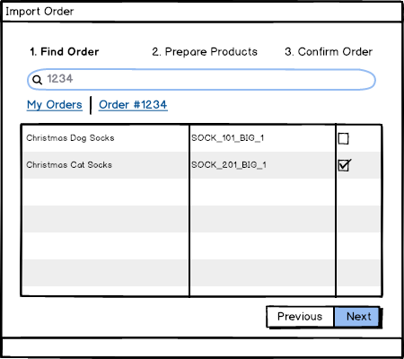

## Create a tiny SPA application with the following business requirements:

* SPA should contain Order list (table) with a button "Import Orders" to import more External Orders

* "Import Orders" should initiate a multi-step wizard (Modal window)
  * "Find Order"

  * "Prepare Products"

  * "Confirm and Order"
  

* SPA must perform step navigation according to the following rules
  * Navigation to the `Next` step is available only of all required data is fulfilled
  * It should be possible to return back and proceed from there (e.g. `Back`, edit and `Next`)
* SPA must consume REST JSON API endpoints for obtaining the data. 
  Static JSON files served over HTTP(S) are acceptable.  
* SPA must paginate data responses over the wire.
* Business requirements might seem underspecified (on purpose). Please do not hesistate and reach out to gather more insights or clarify things as much as possible.  

## Technical requirements:

* You have total control over tools, as long as SPA is written with BackboneJS (and Handlebars.js templates).
* You have control over the choice of UI toolikts, libraries or plain vanilla HTML as long as it works well in modern web browsers.

## What gets evaluated:

* Conformance to business requirements
* Code quality, including testability
* How easy it is to get run and tinker with the SPA (don't make us fetch 500K+ npm modules please 😉)

Good luck and have fun!
